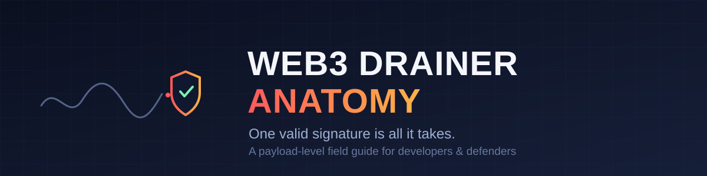
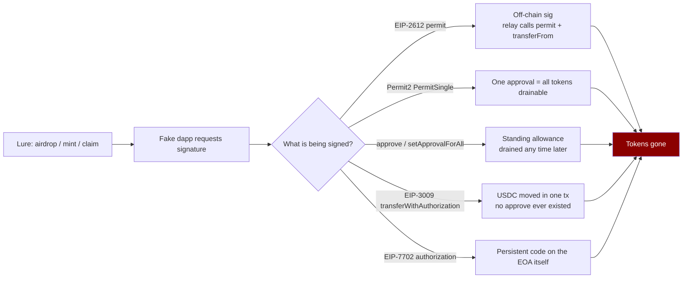

# web3-drainer-anatomy

**A developer's field guide to how modern wallet drainers actually work — and how to stop them.**

---

> **Ethics & scope.** This repository exists to make developers, auditors, and wallet users
> *harder to steal from*. It explains the mechanics of Web3 phishing and wallet-draining at a
> conceptual and code-review level. It deliberately contains **no deployable attack kit** —
> see the [FAQ](#faq) for why. Don't use what you learn here against anyone; draining real
> funds is theft, and "it was for research" is not a defense.

## What this is (and isn't)

| You get | You don't get |
|---|---|
| Payload-level anatomy of permit / Permit2 / EIP-3009 / EIP-7702 / approve drainers | A working, deployable drainer |
| Red-team write-ups of how each vector converts one signature into theft | Lure pages, fake logins, or relay servers you can run against anyone |
| A hands-on **broken-by-design** code-review exercise (find the 3 bugs) | Any mainnet configuration, private keys, or RPC endpoints for attacking |
| Detection heuristics, IOCs, and a layered defense playbook | Guarantees — this field moves weekly |

## Why this matters

Every vector in this repo reduces to one fact:

> **A valid signature over a structured payload is all an attacker needs to move your tokens.**

No private-key leak required. No exploit of Ethereum itself. The victim signs, the attacker
relays. Understanding *exactly* what each signature authorizes is the difference between a
developer who can spot a malicious `signTypedData_v4` request and one who ships an app that
gets their users drained.

## Documentation

Read in order for the full arc, or jump to what you need:

1. **[Orientation & threat model](docs/00-orientation.md)** — who attacks whom, the two-layer model (lure vs. exploit), lab scope.
2. **[Lure vs. exploit: the two-layer model](docs/01-lure-vs-exploit-two-layer-model.md)** — why a static fake page isn't an attack, and what the exploit layer really requires.
3. **[Fake login + gasless signature phish](docs/02-fake-login-and-gasless-phish.md)** — credential harvest → wallet trap funnels, claim-impersonation campaigns, and the myths around "no-code" phishing.
4. **[Hot-wallet sweep myths, debunked](docs/03-hot-wallet-sweep-myths.md)** — why brute-forcing keys is impossible, with the actual 2^256 math.
5. **[Signature vectors primer](docs/04-signature-vectors-primer.md)** — `approve`, EIP-712, EIP-2612/Permit2 mechanics plus the three-layer prevention architecture.
6. **[Red-team implementation report](docs/05-red-team-report.md)** — the deepest doc: five drain vectors at payload level, including a Sepolia end-to-end demonstration.
7. **[Real-world drain vectors beyond the basics](docs/06-real-world-drain-vectors.md)** — Seaport order theft, `eth_sign` abuse, clipboard hijacking, drainer-kit malware, ERC-1271 forgery, and attack economics.
8. **[Detection & defense playbook](docs/07-detection-and-defense.md)** — layered mitigations, detection heuristics, IOCs, and checklists for users, devs, and teams.

Appendix: [Sepolia lab contract addresses](docs/appendix-lab-addresses.md).

## Learning paths

**I'm a wallet user**
Read [00](docs/00-orientation.md), [04](docs/04-signature-vectors-primer.md), then skim the
defense checklist in [07](docs/07-detection-and-defense.md). Ten minutes that can save your
portfolio.

**I build dapps**
Focus on [01](docs/01-lure-vs-exploit-two-layer-model.md), [05](docs/05-red-team-report.md),
and [07](docs/07-detection-and-defense.md). Learn what a malicious integration looks like from
the inside so you can audit the SDKs and links you ship.

**I'm a security researcher / blue teamer**
Everything, but especially [05](docs/05-red-team-report.md),
[06](docs/06-real-world-drain-vectors.md), and the IOC list in
[07](docs/07-detection-and-defense.md).

## Hands-on exercise

[`exercises/01-permit-phishing-BROKEN/`](exercises/01-permit-phishing-BROKEN/) contains a
permit-phishing relay server with **three deliberately injected bugs**. It boots cleanly, logs
look normal — but the attack can never succeed. Your job: find the bugs, explain where the flow
breaks, patch each in one line.

It's the best way to internalize exactly which checks keep a signature flow honest. An answer
key (`ANSWER.md`) sits in the same folder — no peeking until you've tried.

## FAQ

**Where's the working drainer?**
Intentionally not published. A turnkey drain kit has essentially zero defensive value and
enormous offensive value — that trade is bad for everyone. Everything here is written so you
gain the *understanding* without us shipping the *weapon*: payload anatomy, annotated flows,
and a broken exercise instead of live tooling.

**Is any of this runnable?**
Only the exercise above — it runs on Sepolia testnet against placeholder addresses and cannot
function as published. Nothing in this repo touches mainnet.

**Can I use this for my own course or blog post?**
Yes — see the license (CC BY-NC-SA 4.0): share and adapt freely with attribution, non-commercial.

## Contributing

PRs welcome — corrections, new vector write-ups, diagrams, translations. See
[CONTRIBUTING.md](CONTRIBUTING.md) for the one hard rule (no deployable tooling), style
conventions, and the issue templates. Open an issue first for big additions.

## Author

Built and maintained by [**Progress Louya**](https://github.com/Pbuddy0) — security educator.
Questions about using this material in a course or workshop? Open a
[Discussion](https://github.com/Pbuddy0/web3-drainer-anatomy/discussions).

## License

Documentation and exercises are licensed under [CC BY-NC-SA 4.0](https://creativecommons.org/licenses/by-nc-sa/4.0/)
(see [LICENSE](./LICENSE)). Educational use only.
